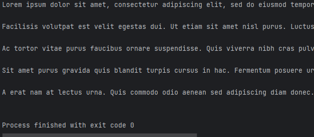

# lab09  

## Задание
    1.Решите задачу своего варианта.
    2.Оформите отчёт в README.md. Отчёт должен содержать:
        Условия задач
        Описание проделанной работы
        Скриншоты результатов
        Ссылки на используемые материалы
## Проделанная работа

Написал по своему варианту (`2`) генератор для построчного чтения файла. 
Если длина строки превышает заданный предел - генератор возвращает подстроку допустимого размера.

## Скриншоты

## Список использованных источников

[лаба](https://evil-teacher.on.fleek.co/prog_pm/lab09/)
